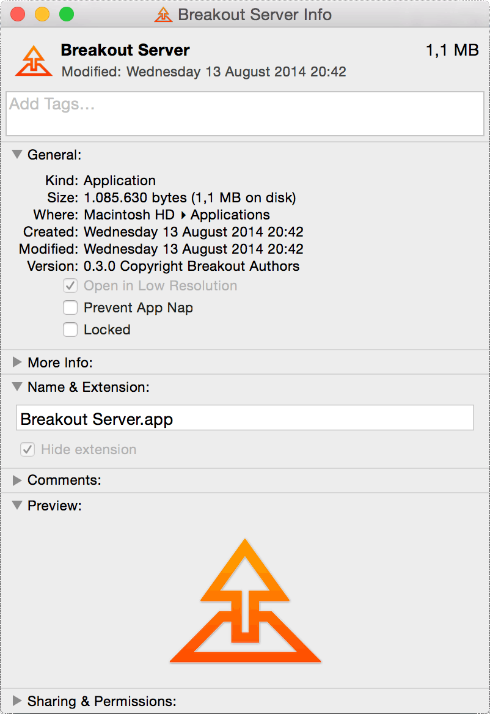

# Hystoria :black_nib:
######Collective stories: a social experiment

The project is about building an installation for the (famous) [Lambrock Festival](http://www.lambrockfestival.com) which takes place in Lambrugo ([here](https://www.google.it/maps/place/Via+Bovia,+5,+22045+Lambrugo+CO/data=!4m2!3m1!1s0x4786a179564d7947:0xc793d363cb460870?sa=X&ei=y6psVcufOsbgywOvh4PoAw&ved=0CCAQ8gEwAA)) every year since 2012.

#####Hystoria makes use of some cool stuff we found around:
- [Arduino](http://www.arduino.cc/)
- [Breakout.js](http://breakoutjs.com/)
- [Right Index icon by Desbenoit](https://thenounproject.com/search/?q=finger&i=5380)

###Fixing Known Issues
When you run the *Breakout.js* server on Mac OS X you may need to do the following ([found here](http://breakoutjs.com/2014/03/breakout-v0-3-1-available/)) to prevent it from sleeping and stop serving:
- `Right click` on the App Package
- Check `Prevent App Nap`(which should be part of the os energy saving features)
- Restart the server

